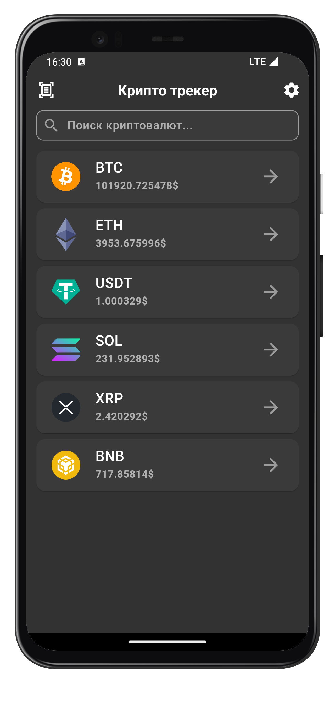
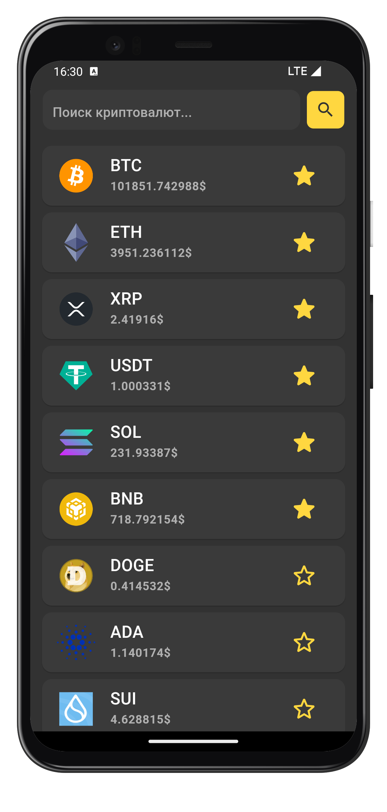
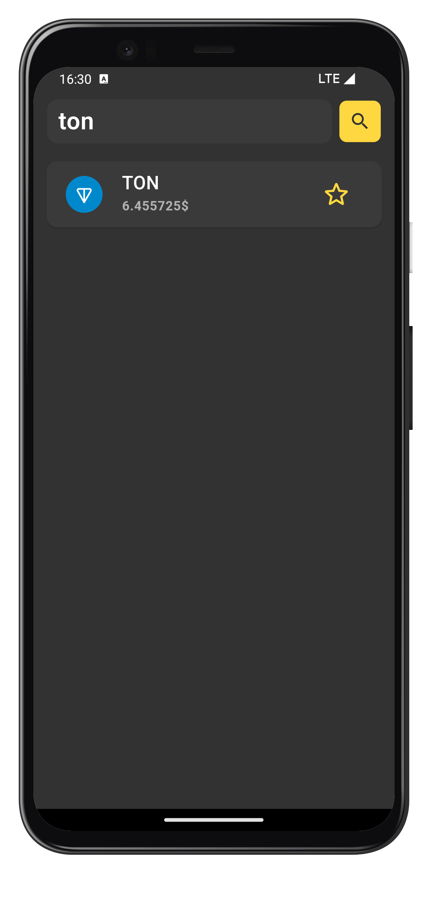

    

<h2 align="center" style="margin: 0px;">Crypto Tracker</h2>

Crypto Tracker is a Flutter application that provides real-time cryptocurrency tracking. With this app, users can view cryptocurrency prices, track their favorite coins, and manage their portfolio conveniently.

### Features

- **Real-Time Updates:** Stay updated with live cryptocurrency prices.
- **Favorites List:** Mark your favorite coins for quick access.
- **Interactive UI:** Seamless navigation and modern design.
- **Drag-and-Drop Functionality:** Reorder coins in your favorites list with ease.
- **Responsive Design:** Fully optimized for various screen sizes.

### Screenshots

|  |  |  |
| :------------: | :------------: | :------------: |

### How to Use

1. Launch the app on your device or emulator.
2. Browse the list of cryptocurrencies and view their current prices.
3. Tap on a coin to view detailed information.
4. Add coins to your favorites for quick access.
5. Reorder your favorite coins by dragging and dropping.

### Technologies Used

- **Flutter:** Framework for building cross-platform applications.
- **Dart:** Programming language for Flutter.
- **API Integration:** Real-time data fetched using CryptoCompare API.
- **State Management:** Using Bloc for efficient state handling.
- **Hive:** Lightweight and fast key-value database for Flutter.
- **AutoRoute:** A fast and efficient routing solution for Flutter.
- **Talker:** Logging and debugging tool for Flutter applications.
- **Intl:** Used to adapt content to different languages.